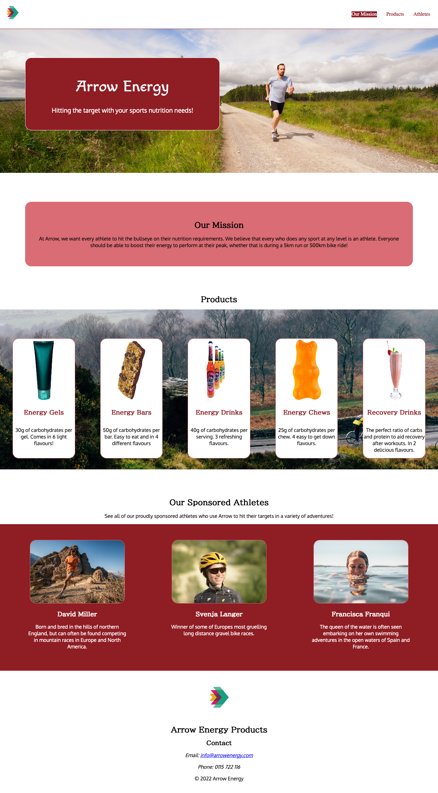

- [Overview](#overview)
  - [Screenshot](#screenshot)
  - [Links](#links)
- [My process](#my-process)
  - [Built with](#built-with)
  - [What I learned](#what-i-learned)
  - [Continued development](#continued-development)
  - [Useful resources](#useful-resources)
- [Acknowledgments](#acknowledgments)

## Overview

A website for an imaginary company based on a challenge on Codeacademy.com.
The aim is to put into practice what we have learned about flexbox and other CSS and semantic HTML.

### Screenshot

### Links

- Solution URL: (https://github.com/Barky213/companyflex)
- Live Site URL: (https://barky213.github.io/companyflex/index.html)

## My process

I first started by simply laying out the structure with HTML. I did it by focussing individually on each section until finished. Then reread the code to check for errors.
After HTML, I followed a similar procedure on CSS for the stying. First I concentrated on the positioning of the text and images of each individual section for different browser sizes. NOTE; this is only for desktop browsers. When I was happy with the images and text for each section, I then focussed on the colour scheme and fonts I would use. I did this last because I felt being able to see the website as a whole would give me abetter idea of suitable fonts and colours.

### Built with

- Semantic HTML5 markup
- CSS custom properties
- Flexbox

### What I learned

This project helped to clear up some confusion I had had with how flexbox affects the container and items. For example, with 'align-items' and 'align-content'

### Continued development

I want to continue to practise with flexbox as I still feel I do not have full knowledge of its possibilities. I would also like to develop my CSS Grid knowledge. Making a website responsive to different devices is also a priority as this project was only for desktop browsers

### Useful resources

- Wes Bos' free Flexbox Course (https://wesbos.com/) - This helped me understand flexbox a little more and gave clear examples of the different uses.

- Unsplash and Pixabay (https://unsplash.com/) / (https://pixabay.com/) - These sites are useful for images and some of the images gave me some ideas.

## Acknowledgments
